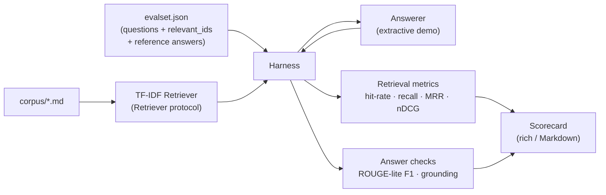

# rag-eval-toolkit

> An offline toolkit to evaluate Retrieval-Augmented Generation (RAG) pipelines — retrieval metrics + answer-quality heuristics, rendered as a scorecard.


## Overview

`rag-eval-toolkit` scores a RAG pipeline against a **labeled eval set** — questions paired with the doc ids that are actually relevant and a reference answer. It computes standard **retrieval metrics** (hit-rate@k, recall@k, MRR, nDCG) and lightweight **answer-quality heuristics** (a ROUGE-lite token-overlap F1 and a citation-grounding check), then prints a rich terminal or Markdown **scorecard**.

The retriever and answerer sit behind small protocols, so you can plug in your own pipeline. The repo ships a bundled sample corpus, a labeled eval set, and a deterministic **TF-IDF retriever** (scikit-learn) so the whole thing runs **fully offline** with fixed seeds — no API keys, no network.

> **Honesty note.** This is a portfolio/demo project. The answer-quality checks are deliberate approximations: ROUGE-lite F1 measures *lexical* overlap only (paraphrases score low even when correct), and the grounding check verifies that cited docs were *retrieved*, not that the answer is factually true. Treat them as cheap signals, not ground truth. The scorecard below is real output from the bundled data — no numbers are hand-edited.

## Architecture



## Metrics

| Metric | What it measures |
| --- | --- |
| Hit-rate@k | Did *any* relevant doc appear in the top-k? (success@k) |
| Recall@k | Fraction of all relevant docs found within the top-k |
| MRR | Reciprocal rank of the first relevant doc — rewards ranking it high |
| nDCG@k | Rank-discounted gain vs. the ideal ordering, normalized to [0, 1] |
| Answer F1 (ROUGE-lite) | Unigram token-overlap F1 between the answer and the reference (lexical only) |
| Citation grounding | Fraction of the answer's `[doc]` citations that were actually retrieved |

## Features

- Pure, unit-tested retrieval metrics (binary relevance) with hand-verified expected values.
- Answer heuristics: ROUGE-lite F1 and a grounding check that flags ungrounded citations.
- Pluggable `Retriever` / `Answerer` protocols — bring your own pipeline.
- Bundled TF-IDF retriever + sample corpus and eval set; deterministic, fixed seeds.
- Rich terminal scorecard and copy-paste Markdown output.
- `rag-eval` console command; runs fully offline.

## Tech stack

Python 3.11 · scikit-learn (TF-IDF + cosine) · NumPy · click (CLI) · rich (scorecard) · pytest.

## Getting started

```bash
# from the repo root
python -m venv .venv && source .venv/bin/activate   # Windows: .venv\Scripts\activate
pip install -e ".[dev]"

# run the evaluation on the bundled sample data
rag-eval                 # rich terminal scorecard
rag-eval --markdown      # Markdown scorecard
rag-eval -k 5            # change the retrieval cutoff
```

Point it at your own data with `--corpus path/to/corpus` (a folder of `.md` docs) and `--evalset path/to/evalset.json`.

## Usage

Running `rag-eval --markdown` on the bundled 13-question eval set and 8-doc corpus produces the scorecard below. This is **real, reproducible tool output** (fixed seeds, offline):

### RAG Eval Scorecard (k=3)

| Metric | Score |
| --- | --- |
| Hit-rate@k | 1.000 |
| Recall@k | 0.962 |
| MRR | 0.962 |
| nDCG@k | 0.947 |
| Answer F1 (ROUGE-lite) | 0.137 |
| Citation grounding | 1.000 |

| Q | Hit | Recall | MRR | nDCG | F1 | Ground |
| --- | --- | --- | --- | --- | --- | --- |
| q1 | 1 | 1.00 | 1.00 | 1.00 | 0.10 | 1.00 |
| q2 | 1 | 1.00 | 1.00 | 1.00 | 0.20 | 1.00 |
| q3 | 1 | 1.00 | 1.00 | 1.00 | 0.14 | 1.00 |
| q4 | 1 | 1.00 | 1.00 | 1.00 | 0.18 | 1.00 |
| q5 | 1 | 1.00 | 1.00 | 1.00 | 0.20 | 1.00 |
| q6 | 1 | 1.00 | 1.00 | 1.00 | 0.17 | 1.00 |
| q7 | 1 | 1.00 | 1.00 | 1.00 | 0.17 | 1.00 |
| q8 | 1 | 1.00 | 1.00 | 1.00 | 0.17 | 1.00 |
| q9 | 1 | 1.00 | 1.00 | 1.00 | 0.10 | 1.00 |
| q10 | 1 | 1.00 | 1.00 | 1.00 | 0.00 | 1.00 |
| q11 | 1 | 1.00 | 1.00 | 0.92 | 0.14 | 1.00 |
| q12 | 1 | 0.50 | 0.50 | 0.39 | 0.07 | 1.00 |
| q13 | 1 | 1.00 | 1.00 | 1.00 | 0.14 | 1.00 |

**Reading the results.** TF-IDF nails the single-topic questions (q1–q10), so hit-rate and MRR are perfect there. The multi-relevant questions expose real ranking limits: **q12** ("which services durably store or replicate data") is the hard case — the retriever ranks DynamoDB above the truly relevant S3 and pushes S3 out of the top-3, so recall and MRR drop to 0.50 and nDCG to 0.39. The low Answer F1 (~0.14) is expected and honest: the demo answerer extracts a single sentence, so it overlaps only partially with the fuller reference answers — F1 is a *lexical* measure, not a correctness verdict. Grounding is 1.0 because the demo answerer only ever cites the doc it retrieved; the grounding *check* itself is exercised against ungrounded citations in the test suite.

## Project structure

```
rag-eval-toolkit/
├── rageval/
│   ├── __init__.py
│   ├── metrics.py          # pure retrieval metrics: hit_rate, recall_at_k, mrr, ndcg
│   ├── answer_metrics.py   # ROUGE-lite F1 + citation grounding check
│   ├── retriever.py        # Retriever protocol + TF-IDF demo retriever
│   ├── harness.py          # runs retriever+answerer over the eval set, collects scores
│   ├── report.py           # rich + Markdown scorecard renderers
│   ├── datasets.py         # load corpus + eval set
│   └── cli.py              # `rag-eval` console entry point
├── data/
│   ├── corpus/*.md         # small sample document set (8 docs)
│   └── evalset.json        # questions + relevant_ids + reference answers (13 queries)
├── tests/                  # pytest: metric math, grounding, end-to-end harness
├── requirements.txt
├── pyproject.toml
├── .github/workflows/ci.yml
├── LICENSE
└── README.md
```

## Testing

```bash
pip install -e ".[dev]"
pytest
```

The suite (29 tests, fully offline) covers: metric math against hand-computed values (MRR/nDCG known cases), the grounding check flagging ungrounded citations, ROUGE-lite F1 edge cases, and an end-to-end harness run over the bundled sample data (including determinism). CI runs the same suite on GitHub Actions.

## Roadmap

- Additional retrievers behind the protocol (BM25, dense/embedding — kept offline where possible).
- Graded (non-binary) relevance and nDCG with graded gains.
- Semantic answer scoring (embedding similarity) as an optional, opt-in extra.
- Per-query CSV/JSON export and score diffing between pipeline versions.
- Confidence intervals via bootstrap over the query set.

## License

MIT — see [LICENSE](LICENSE).

---

Part of my cloud & AI portfolio — see [github.com/matthews-wong](https://github.com/matthews-wong).
